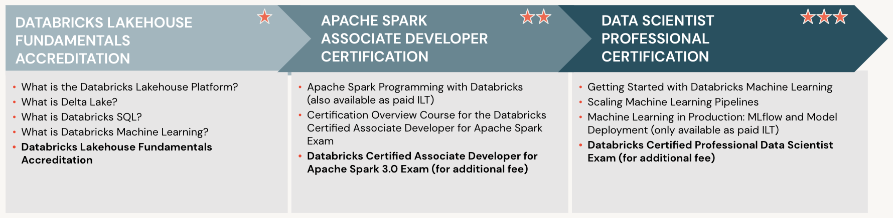

# Data Scientist Learning Plan

Demonstrate the breadth and depth of your data science skills by earning all of the Databricks Data Scientist credentials.

This learning path consists of several series of self-paced (E-Learning) courses and paid instructor-led courses. If you are interested in ILT, please be sure to search the course catalog for more information.

## Learning Plan Structure

- **What is the Databricks Lakehouse Platform?**
  
    This course (formerly Fundamentals of the Databricks Lakehouse Platform) is designed for everyone who is brand new to the Platform and wants to learn more about what it is, why it was developed, what it does, and the components that make it up.  
    
    Our goal is that by the time you finish this course, you’ll have a better understanding of the Platform in general and be able to answer questions like: What is Databricks? Where does Databricks fit into my workflow? How have other customers been successful with Databricks?

    Learning objectives
    - Describe what the Databricks Lakehouse Platform is.
    - Explain the origins of the Lakehouse data management paradigm.
    - Outline fundamental problems that cause most enterprises to struggle with managing and making use of their data.
    - Identify the most popular components of the Databricks Lakehouse - Platform used by data practitioners, depending on their unique role.
    - Give examples of organizations that have used the Databricks Lakehouse Platform to streamline big data processing and analytics.

- **What is Delta Lake?**
    
    Today, many organizations struggle with achieving successful big data and artificial intelligence (AI) projects. One of the biggest challenges they face is ensuring that quality, reliable data is available to data practitioners running these projects. After all, an organization that does not have reliable data will not succeed with AI. To help organizations bring structure, reliability, and performance to their data lakes, Databricks created Delta Lake.

    Delta Lake is an open format storage layer that sits on top of your organization’s data lake. It is the foundation of a cost-effective, highly scalable Lakehouse and is an integral part of the Databricks Lakehouse Platform.

    In this course (formerly Fundamentals of Delta Lake), we’ll break down the basics behind Delta Lake - what it does, how it works, and why it is valuable from a business perspective, to any organization with big data and AI projects.

    Learning objectives
    - Describe how Delta Lake fits into the Databricks Lakehouse Platform.
    - Explain the four elements encompassed by Delta Lake.
    - Summarize high-level Delta Lake functionality that helps organizations solve common challenges related to enterprise-scale data analytics.
    - Articulate examples of how organizations have employed Delta Lake on Databricks to improve business outcomes.

- **What is Databricks SQL?**
  
    Databricks SQL offers SQL users a platform for querying, analyzing, and visualizing data.  This course (formerly Fundamentals of Databricks SQL) guides users through the interface and demonstrates many of the tools and features available in the Databricks SQL interface.

    Learning objectives
    - Describe the basics of the Databricks SQL service.
    - Describe the benefits of using Databricks SQL to perform data analyses.
    - Describe how to complete a basic query, visualization, and dashboard workflow using Databricks SQL.

- **What is Databricks Machine Learning?**
  
    Databricks Machine Learning offers data scientists and other machine learning practitioners a platform for completing and managing the end-to-end machine learning lifecycle. This course (formerly Fundamentals of Databricks Machine Learning) guides business leaders and practitioners through a basic overview of Databricks Machine Learning, the benefits of using Databricks Machine Learning, its fundamental components and functionalities, and examples of successful customer use.

    Learning objectives
    - Describe the basic overview of Databricks Machine Learning.
    - Identify how using Databricks Machine Learning benefits data science and machine learning teams.
    - Summarize the fundamental components and functionalities of Databricks Machine Learning.
    - Exemplify successful use cases of Databricks Machine Learning by real Databricks customers.

- Fundamentals of the Databricks Lakehouse Platform Accreditation
- Apache Spark Programming with Databricks
- Certification Overview Course for the Databricks Certified Associate Developer for Apache Spark Exam
- Getting Started with Databricks Machine Learning
- Scaling Machine Learning Pipelines