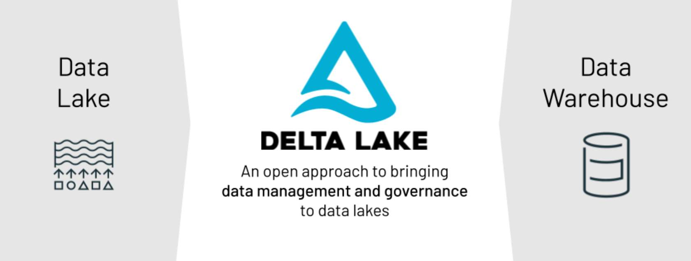
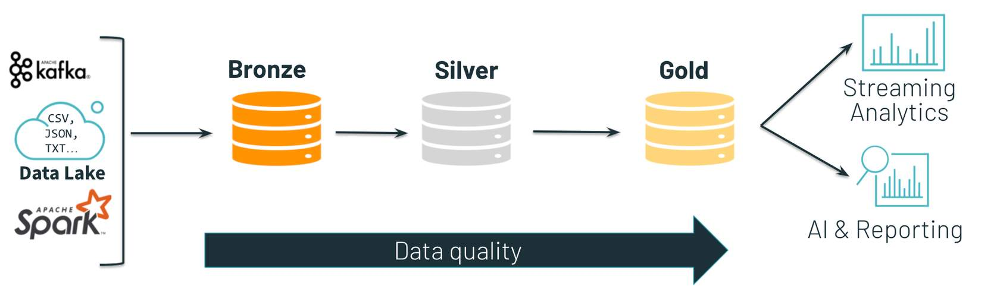
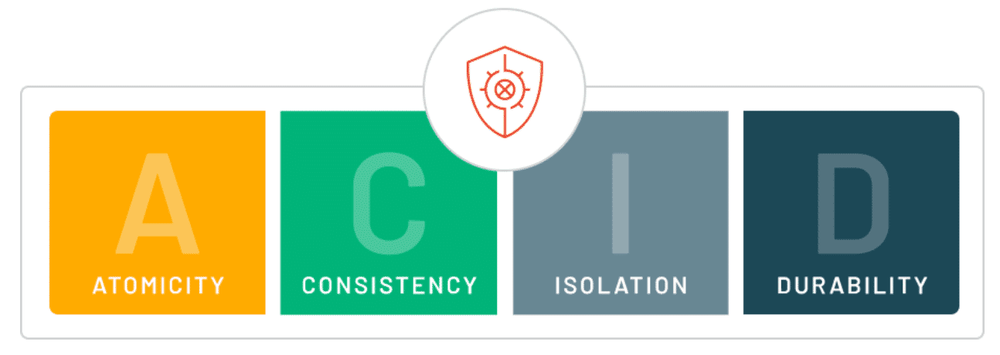
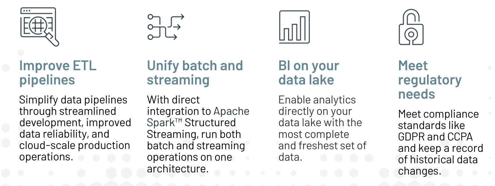

# Fundamentals of Delta Lake

## An Introduction to Delta Lake on Databricks

Delta Lake is an open format storage layer that puts standards in place in an organization’s data lake to provide data structure and governance. These standards ensure that all the data stored in a data lake is reliable and ready to use for business needs. It was developed at Databricks and open-sourced in early 2019. 

**Why Delta Lake?** 

Delta Lake was created by Databricks to help organizations address challenges with storing and managing big data using data lakes. These challenges are addressed in other Databricks Academy courses but for context, we'll summarize them here.

Data lakes are popular choices for data storage due to their inherent flexibility over data warehouses. Besides storing all types of data (structured, unstructured, and semi-structured), they also store data relatively cheaply compared to data warehouses. Data lakes are crucial to organizations running big data and analytics projects because unstructured data like videos and audio files lend themselves nicely to AI analytics techniques like machine learning. Plus, economic data storage allows organizations to keep data for longer periods of time until they decide what the best uses for that data are, without incurring hefty costs.

The flexibility that data lakes bring to data management and storage is also one of their biggest shortcomings. Because they store all data types for long periods, data lakes can quickly become data swamps. Data swamps are data lakes that are difficult to navigate and manage. Delta Lake was designed to bring the governance and structure of data warehouses into data lakes to, above all else, ensure that the data in an organization’s data lake is reliable for use in big data and AI projects.

As mentioned at the beginning of this lesson, Delta Lake was designed to bring the governance and structure of data warehouses into data lakes to, above all else, ensure that the data in an organization’s data lake is reliable for use in big data and AI projects. Why is this important to an organization? Having reliable and performant data is the first step in running successful big data and AI projects - doing things like creating recommendation engines, performing DNA sequencing, tackling risk and fraud detection, and more.

**Where does Delta Lake fit into the Databricks Lakehouse Platform?**

Recall from previous Databricks Academy courses that a Lakehouse is a data storage paradigm and architecture that combines the most popular functionality of data warehouses and data lakes. By bringing the structure and governance inherent to data warehouses to data lakes with Delta Lake, you create the foundation for a Lakehouse. In other words, Delta Lake lays the foundation for a Lakehouse. 

The image below depicts where Delta Lake fits into the Databricks Lakehouse Platform. Once data lands into an open data lake, Delta Lake is used to prepare that data for data engineering, business intelligence, SQL analytics, data science, and machine learning use-cases. 

**How is Delta Lake used to Organize Data?**

When using Delta Lake, data practitioners tend to follow an architecture pattern that consists of organizing ingested data into successively cleaner tables - starting with bronze tables, moving to silver tables, and then moving to gold tables.

- **Bronze**: Bronze tables contain raw data ingested from various sources (JSON files, RDBMS data,  IoT data, etc.). Data in bronze tables is often kept for years and can be saved “as-is” - in other words, it is kept in its raw state (data practitioners don’t clean or parse this data).
- **Silver**: Silver tables provide a more refined view of an organization’s data - this data is directly queryable and ready for big data and AI projects. Data in a silver table is often joined from various bronze tables to enrich records or update records based on recent activity. Data in a silver table is clean, normalized, and referred to as your single source of truth - the data that all data practitioners access for their projects. This ensures that everyone is working with the most up-to-date data. 
- **Gold**: Gold tables provide business-level aggregates used for particular use-cases - for example, if the sales department for an online retailer needs to create a weekly dashboard for a specific set of data every week. In this case, a data engineer can prepare this data for that department and include aggregations such as daily active website users, weekly sales per store, or gross revenue per quarter by the department. The data stored in Gold tables are usually related to one particular business objective. 

## Elements of Delta Lake

### 1. Delta Files

Delta Lake uses Parquet files to store a customer’s data in the customer's cloud storage account.

Parquet is a columnar file format that provides optimizations to speed up queries and is a far more efficient file format than CSV or JSON. The columnar storage allows you to quickly skip over non-relevant data while executing queries.

Delta files leverage all of the technical capabilities of Parquet files but have an additional layer over them. This additional layer tracks data versioning and metadata, stores transaction logs to keep track of changes made to a data table or object storage directory, and provides ACID transactions. 

### 2. Delta Tables

A Delta table is a collection of data kept using the Delta Lake technology and consists of three things:

1. Delta files containing the data and kept in object storage

2. A Delta table registered in a Metastore (a metastore is simply a catalog that tracks your data’s metadata - data about your data)

3. The Delta Transaction Log saved with Delta files in object storage

### 3. Delta Optimization Engine

Delta Engine is a high-performance query engine that provides an efficient way to process data in data lakes. Delta Engine accelerates data lake operations and supports a variety of workloads ranging from large-scale ETL processing to ad-hoc, interactive queries. Many of these optimizations take place automatically; you get the benefits of these Delta Engine capabilities just by using Databricks for your data lakes. 

What the Delta Optimization Engine means for your business is that your data workloads run faster, so data times can perform their work in less time. 

### 4. Delta Lake Storage Layer

When using Delta Lake, your organization stores its data in a Delta Lake Storage Layer and then accesses that data via Databricks. A key idea here is that an organization keeps all of this data in files in object storage. This is beneficial because it means your data is kept in a lower-cost and easily scalable environment. 

## Delta Lake Functionality for Data Reliability

Challenges with Data Lakes:

| Challenge |  |
| :---: | :----------- |
| Reading and writing data is not reliable | Data engineers often run into the problem of unsafe writes into data lakes that cause readers to see garbage data during writes. They have to build workarounds to ensure readers always see consistent data during writes. |
| Jobs often fail midway | Because a single update to a data lake might contain numerous files written one after another, if the update fails after some files have been written, it’s difficult to recover the correct state of the data. Data engineers often spend countless hours troubleshooting failed jobs and getting to a valid state of the data. |
| Modification of existing data is difficult. | Data lakes are to have data written once and then read many times. The concept of modifying or deleting data wasn’t of central importance at the time they were designed. With regulatory measures like GDPR and CCPA, companies must be able to identify and delete a user’s data should they request it. |
| Real-time data is difficult to leverage.| Many organizations struggle to implement solutions that allow them to leverage real-time data with their historical records. Keeping multiple systems and pipelines in sync can be expensive, and it’s difficult to solve possible consistency problems. |
| Keeping historical versions of data is costly. | Some industries have strict regulations for model and data reproducibility that require historical versions of data to be maintained. With the huge scale of data present in a data lake, it can be extremely expensive and difficult to archive this data for compliance. |
| It is difficult to handle large metadata. | For organizations with truly massive data, reading metadata (the information about the files containing the data and the nature of the data) can often create substantial delays in processing and overhead costs. |
| “Too many files” cause problems. | Some applications regularly write small files out to data lakes; over time, millions of files might build up. Query performance suffers greatly when a small amount of data is spread over too many files. |
| It is hard to get great performance. | While some strategies exist to improve performance when working on data in a data lake, even many of our most technologically advanced customers can struggle with tuning their jobs. Great performance should be easy to achieve. |
| Data quality issues affect analysis results.  | Because data lakes don’t have the built-in quality checks of a data warehouse, queries against data lakes need to constantly be assessing data quality and anticipating possible issues. If proper checks are not executed, expensive, long-running queries may fail or produce meaningless results. |

**How does Delta Lake address these pain points to ensure reliable, ready-to-go data?**

**1. ACID Transactions**

Many of these issues are addressed by the way Delta Lake adds ACID transactions to data lakes. 

ACID stands for atomicity, consistency, isolation, and durability, which are a standard set of guarantees most databases are designed around. Since most data lakes have multiple data pipelines that read and write data at the same time, data engineers often spend a significant amount of time to make sure that data remains reliable during these transactions. With ACID transactions, each transaction is handled as having a distinct beginning and end. This means that data in a table is not updated until a transaction successfully completes, and each transaction will either succeed or fail fully. 

These transactional guarantees eliminate many of the motivations for having both a data lake and a data warehouse in an architecture. Appending data is easy, as each new write will create a new version of a data table, and new data won’t be read until the transaction completes. This means that data jobs that fail midway can be disregarded entirely. It also simplifies the process of deleting and updating records - many changes can be applied to the data in a single transaction, eliminating the possibility of incomplete deletes or updates.

**2. Schema Management**

Delta Lake gives you the ability to specify and enforce your data schema. It automatically validates that the schema of the data being written is compatible with the schema of the table it is being written into. Columns that are present in the table but not in the data are set to null. If there are extra columns in the data that are not present in the table, this operation throws an exception. This ensures that bad data that could corrupt your system is not written into it. Delta Lake also enables you to make changes to a table’s schema that can be applied automatically.

**3. Scalable Metadata Handling**

Big data is very large in size, and its metadata (the information about the files containing the data and the nature of the data) can be very large as well. With Delta Lake, metadata is processed just like regular data - with distributed processing. 

**4. Unified Batch and Streaming Datas**

Delta Lake is designed from the ground up to allow a single system to support both batch and stream processing of data. The transactional guarantees of Delta Lake mean that each micro-batch transaction creates a new version of a table that is instantly available for insights. Many Databricks users use Delta Lake to transform the update frequency of their dashboards and reports from days to minutes while eliminating the need for multiple systems.

**5. Data Versioning and Time Travel**

With Delta Lake, the transaction logs used to ensure ACID compliance create an auditable history of every version of the table, indicating which files have changed between versions. This log makes it easy to retain historical versions of the data to fulfill compliance requirements in various industries such as GDPR and CCPA. The transaction logs also include metadata like extended statistics about the files in the table and the data in the files. Databricks uses Spark to scan the transaction logs, applying the same efficient processing to the large amount of metadata associated with millions of files in a data lake.

By now, you should have a better understanding of how Delta Lake’s functionality helps organizations overcome issues with their data lakes - improving their data pipelines, unifying real-time and back data, enabling the performance of business intelligence workloads on their most complete and freshest set of data, and meeting regulatory needs.

