# Fundamentals of the Databricks Lakehouse Platform

## An Introduction to Databricks

What is Databricks?

**Databricks** is known as the Data and AI company. It is a Software-As-A-Service company that makes big data and AI easier for organizations to manage,  enabling data-driven innovation in all enterprises. 
**the Databricks Lakehouse Platform** empowers everyone on a data science team to work together, in one secure platform, from the minute data is ingested into an organization through when it’s cleaned up, analyzed, and used to inform business decisions. 

What does Databricks help organizations do? 

The Databricks Lakehouse Platform enables organizations to: 

- Ingest, process, and transform massive quantities and types of data
- Explore data through data science techniques, including but not limited to machine learning
- Guarantee that data available for business queries is reliable and up to date 
- Provide data engineers, data scientists, and data analysts the unique tools they need to do their work
- Overcome traditional challenges associated with data science and machine learning workflows (we will explore this in detail in our next lesson)

Primarily, data practitioners access Databricks functionality using a custom-built, web-based interface.  This is an environment for accessing all of your Databricks assets (like notebooks, libraries, experiments, and dashboards), as well as the computational resources you need to process data. So, while you might be using different tools/functionality within the Databricks workspace depending on your role, everyone is working in one platform.  We'll talk more about the characteristics of lakehouse architecture later in this course. For now, we can say that a single, unified system is one of the core concepts that defines a lakehouse, and this is part of what makes Databricks the Lakehouse Platform. 

## Big Data and AI Challenges that Databricks Solves

### 1. working with big data is not easy

As explained in previous Databricks Academy courses, big data is hard to manage. This is because it comes into an organization in massive volumes, faster than ever before, and in a wide variety of formats. 

As data practitioners work to design their organization’s big data infrastructure, they often ask and need to answer questions like:  

- Where/how will we store our big data?
- How can we process batch and stream data?
- How can we use different types of data together in our analyses (unstructured vs. structured data)?
- How can we keep track of all of the work we’re doing on our big data?

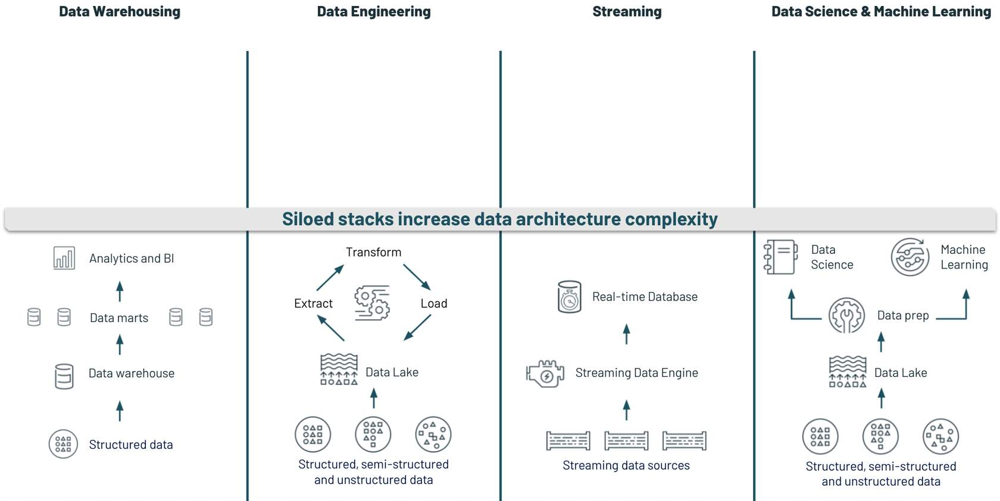

Often, these technology stacks don’t work well together due to many different tools introduced that are not compatible with each other, proprietary data formats that are not easy to translate from one tool to another. If you want to enable advanced use-cases, you have to move across these stacks. Think about the work your organization does. You don’t typically have a “data warehouse use case” or a “streaming” use case. You most likely have a supply chain logistics use case or a financial risk assessment use case. To address these challenges, you need to move across these technology stacks. 

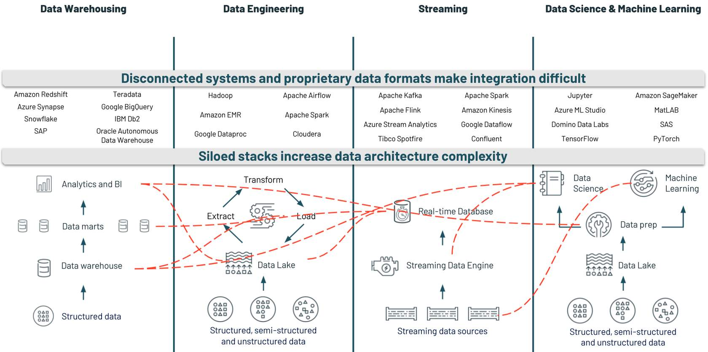

### 2. Siloed roles lead to organizational inefficiencies. 

With multiple stacks set up, many organizations suffer from the challenges of having siloed functional roles for individuals on their data science teams. For example, it is not uncommon for a data scientist to build and train a machine learning model in a vacuum on their computer, with little to no visibility to related work being done by, for example, the data engineer preparing that data for them or the data analysts who might be using results from their experiments to produce dashboards. This leads to communication slowdowns and teams working with different versions of the same data. This affects data security and governance and ultimately results in less productive data teams. 

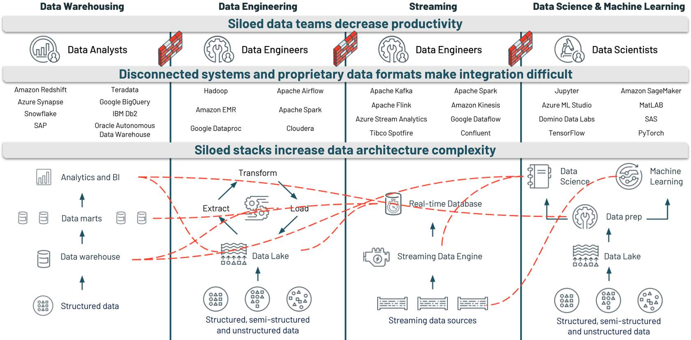

### 3. Data security challenges

Think about the ramifications of a security breach. Beyond just the immediate monetary cost, there is a long-lasting loss in customer trust and company reputation. If you’ve ever been a customer of a company that has suffered a security breach, you know first-hand how long it can take to rebuild trust. 

Besides protecting data from leaking out, organizations must ensure they’re compliant with data protection regulations like GDPR (European Union’s General Data Protection Regulation) and HIPAA (Health Insurance Portability and Accountability Act). Plus, they must have the required certifications to run their businesses. There are often hefty penalties if they are not compliant. 

## The Lakehouse Paradigm

Recap:

**Data Warehouses**

Data warehouses generally follow a set of guidelines to design systems controlling the flow of data used in decision-making. They are designed to optimize data queries, prevent conflicts between concurrently running queries, support structured data, and make the assumption that data entered is unlikely to change with high frequency. 

Because data warehouses originally were developed using on-premises technology to drive BI decisions, they have had some pain points in adapting to the modern data ecosystem. The proliferation of smart devices and web-based commerce has increased both the volume and the variety of data. Data warehouses traditionally rely on proprietary data formats, which do not support video, image, or free-form text files. This leads to limited support for machine learning workloads. 

Traditional data warehouse technologies force users to invest in enough compute power and storage to handle their peak user traffic. With the exponential growth many companies have seen in their data in recent years, this design can become extremely expensive.

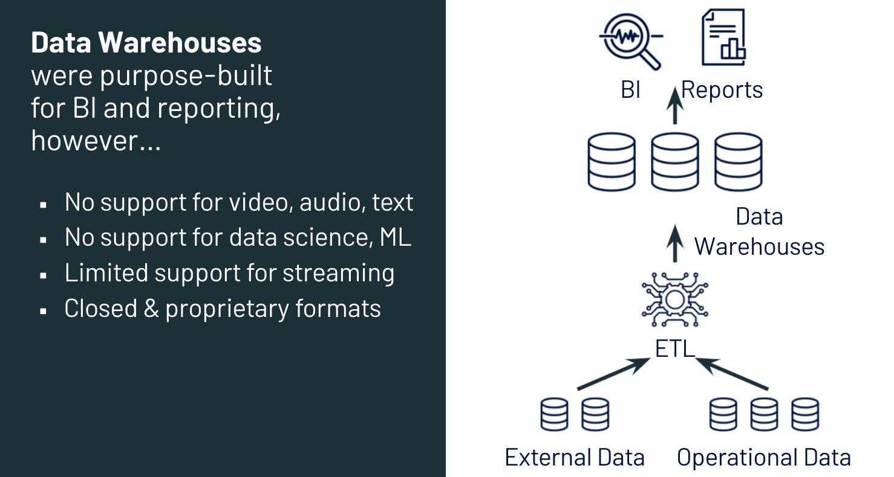

**Data Lakes**

Data lakes are often defined in opposition to data warehouses: while a data warehouse delivers clean, structured data for BI analytics, a data lake allows an organization to permanently and cheaply store data of any nature in any format - in fact, data lakes allow both structured and semi-structured data to be stored alongside unstructured data like video, images, free text, and log files. 

Unlike in data warehouses, data storage and compute are not coupled in data lake design. This has led to several technologies that have evolved around working with data stored in data lakes. Apache Spark, for example, the compute engine used by Databricks, can run analytic queries, extract-transform-load, and machine learning workloads over enormous quantities of data stored in data lakes. 

For all their strengths, data lakes have not eliminated the need for data warehouses. For BI analytics, most companies continue to load the relevant data from their data lake into a data warehouse, and it is here that most analysts execute queries and generate reports. Also, because all of an organization's data lands in a data lake, they can quickly become what is known as a data swamp - a poorly maintained data lake that is difficult to navigate and query. 

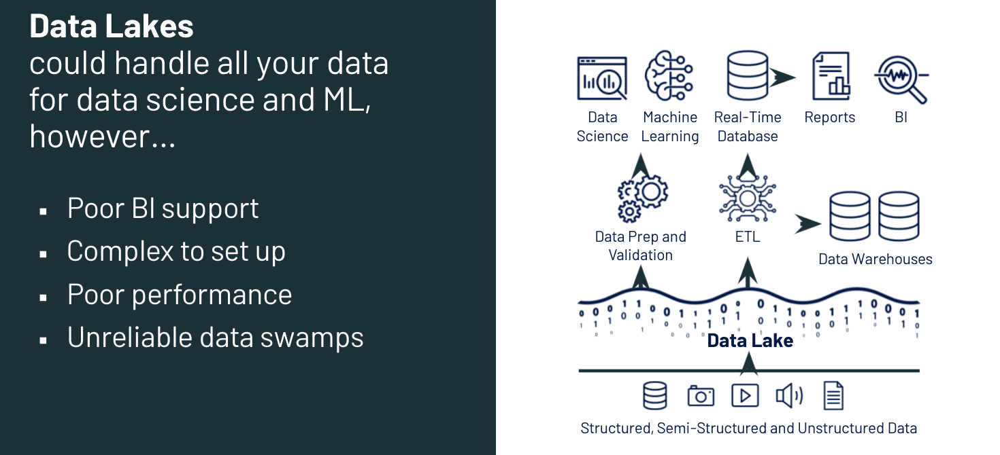

**Lakehouse**

A data lakehouse is a new, open data management paradigm that combines the most popular capabilities of data lakes and data warehouses. A lakehouse implemention uses similar data structures and data management features to those in a data warehouse, directly on the kind of low-cost storage used for data lakes. Merging these ideas into a single system means that data teams can move faster as they can use data without accessing multiple systems. Data lakehouses also ensure that teams have the most complete and up-to-date data available for data science, machine learning, and business analytics projects.

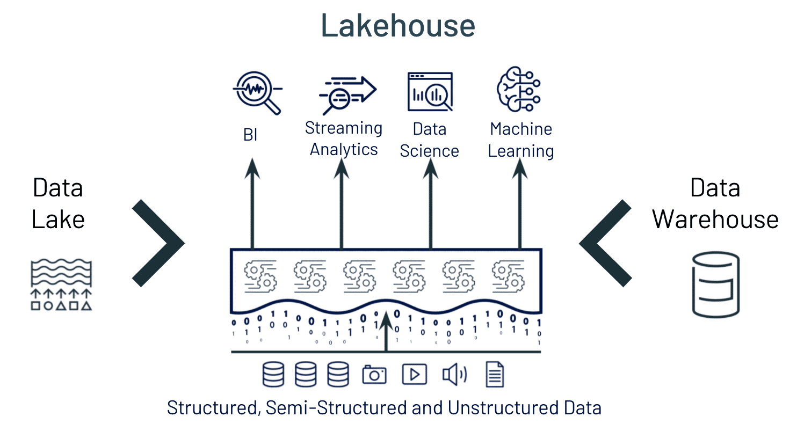

Data lakehouses have the following key features:

- Transaction support to ensure that multiple parties can concurrently read or write data
- Data schema enforcement to ensure data integrity (writes to a table are rejected if they do not match the table’s schema)
- Governance and audit mechanisms to make sure you can see how data is being used 
- BI support so that BI tools can work directly on source data - this reduces data staleness.
- Storage is decoupled from compute, which means that it is easier for your system to scale to more concurrent users and data sizes.
- Openness - Storage formats used are open and standard. Plus, APIs and various other tools make it easy for team members to access data directly
- Support for all data types - structured, unstructured, semi-structure
- End-to-end streaming so that real-time reporting and real-time data can be integrated into data analytics processes just as existing data is
- Support for diverse workloads, including data engineering, data science, machine learning, and SQL analytics - all on the same data repository.

## Databricks Lakehouse Platform Components

Conceptual view of the Databricks Lakehouse Platform: different data types (structured, semi-structured, etc.) come into the platform and land in an open data lake. Delta Lake (which we'll discuss below) is added to that data lake, providing an added layer to your data lake that provides structure and governance to your organization's data. This data is then used to drive business use-cases in data engineering, business intelligence and SQL analytics, real-time data applications, and data science and machine learning. 

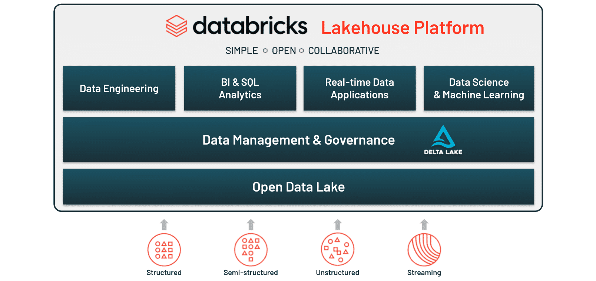

### 1. Databricks Lakehouse Platform for Data Engineering: Delta Lake 

When data arrives into the Lakehouse Platform, it lands into your organization’s open data lake. By adding Delta Lake to that open data lake, you achieve the "Lakehouse" part of the platform. In other words, the Lakehouse is essentially an open data lake with Delta Lake placed on top of it. 

Delta Lake is an open-source storage layer that brings data reliability to data lakes. When we talk about data reliability, we refer to the accuracy and completeness of your data. In other words, Delta Lake working in conjunction with a data lake is what lays the foundation for your Lakehouse - that combination guarantees that your data is what you need for your use-cases via:
- ACID transactions, which are database transaction properties that guarantee data validity. With ACID transactions, you don’t have to worry about missing data or inconsistencies in your data from interrupted or deleted operational transactions because changes to your data are performed as if they are a single operation. 
- Indexing, which allows you to get an unordered table (which might be inefficient to query) into an order that will maximize the efficiency of your queries
- Table access control lists (ACLs), or governance mechanisms that ensure that only users who should have access to data can access it
- Expectation-setting, which refers to the ability for you to configure Delta Lake based on your workload patterns and business needs

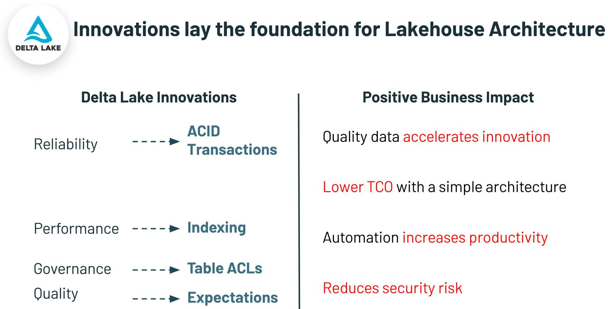

With Delta Lake, data engineers can architect pipelines for continuous data flow and refinement using Delta’s architectural model, shown in the image below. It allows data engineers to build pipelines that begin with raw data as a “single source of truth” from which everything flows. Subsequent transformations and aggregations can be recalculated and validated to ensure that business-level aggregate tables are still reflective of the underlying data, even as downstream users refine the data and introduce context-specific structure.

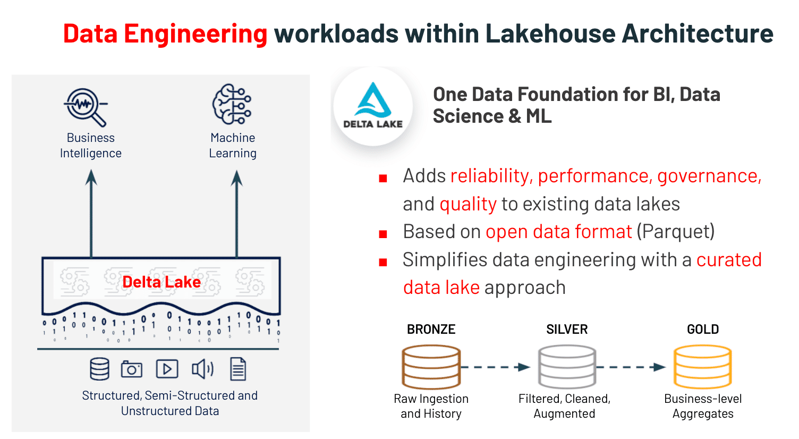

## 2. Databricks Lakehouse Platform for BI & SQL Analytics: Databricks SQL

Databricks SQL provides SQL users a SQL-native Interface to write queries that explore their organization’s Delta Lake table. Regularly used SQL code can be saved as snippets for quick reuse, and query results can be cached to keep the query short.

Once queries are built, Databricks SQL also allows analysts to make sense of the results through a wide variety of visualizations. The visualizations can be organized into dashboards through a drag-and-drop interface. Dashboards can be easily shared with other users to provide insights. They are also configurable to automatically refresh and alert your team to meaningful changes in your data.

Since Databricks SQL was designed to work with Delta Lake, practitioners get the performance optimizations, governance, and reliability that come with that. 

Plus, it supports existing BI tools, which means that you can use your preferred visualization tools to query your organization’s Lakehouse. 

  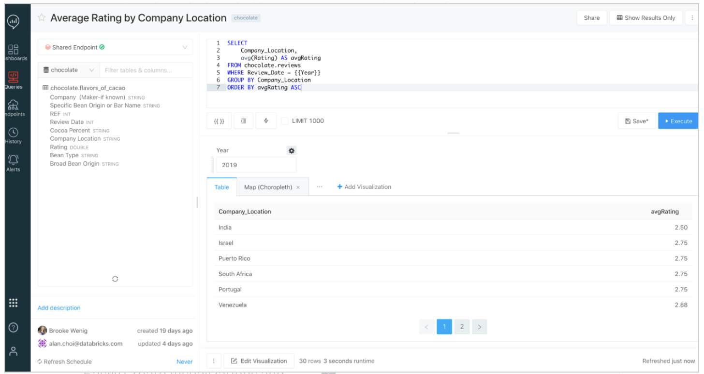
  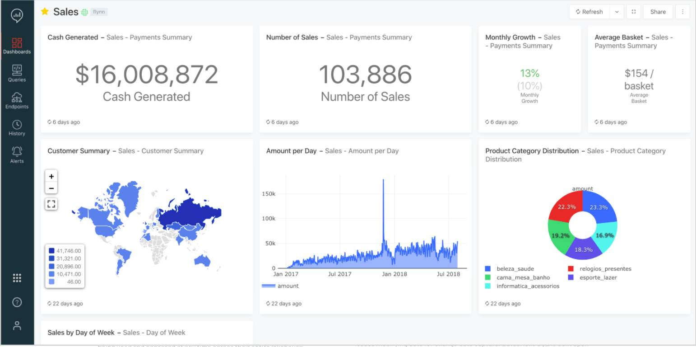 
  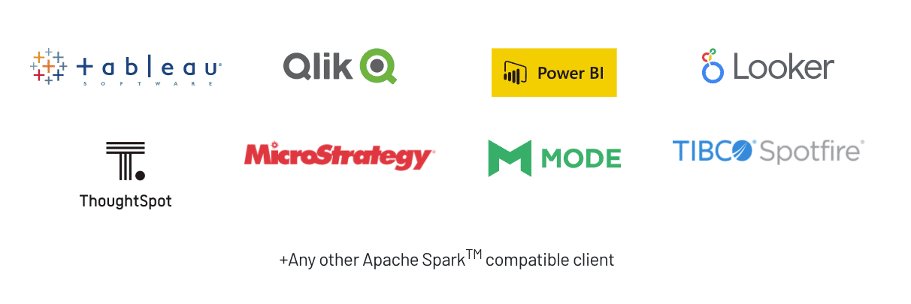

## 3. Databricks Lakehouse Platform for Data Science & Machine Learning: Databricks Machine Learning 

Databricks Machine Learning (Databricks ML) was created for machine learning teams to explore data, prepare and process data, build and test machine learning models, deploy those models, and optimize them. In other words, it is the part of the Databricks Lakehouse Platform tailored for machine learning teams to work on their projects throughout the entire machine learning lifecycle. 

  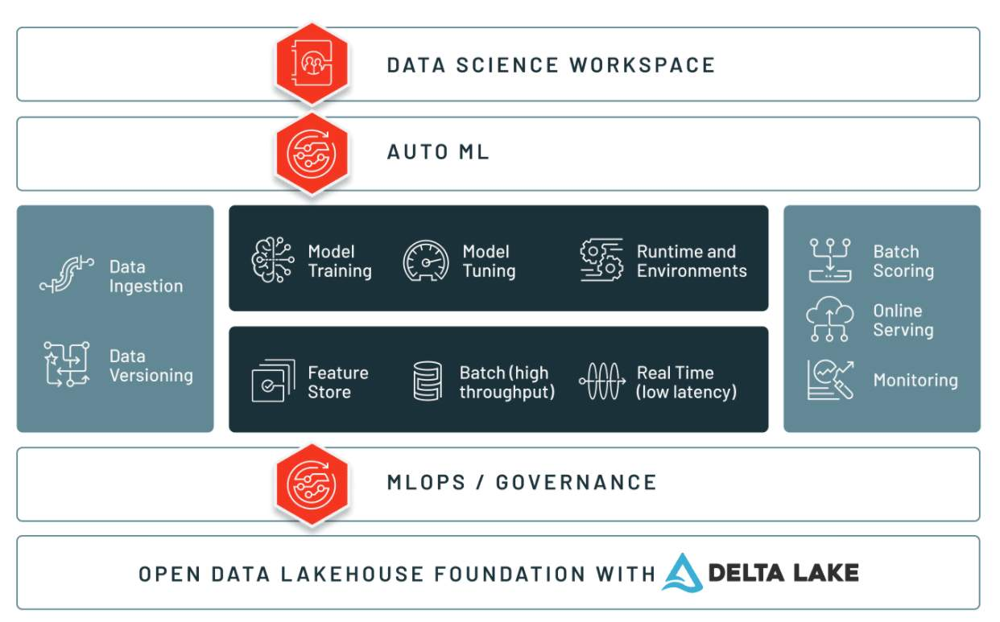
  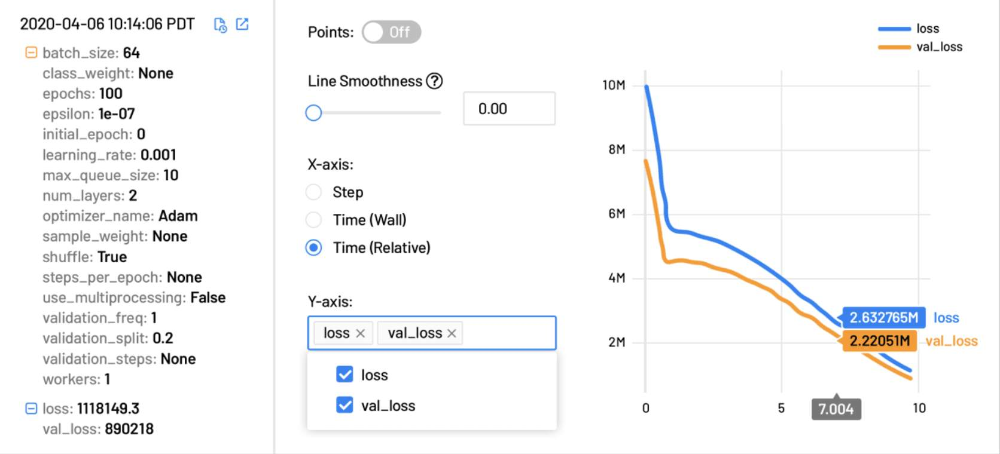 
  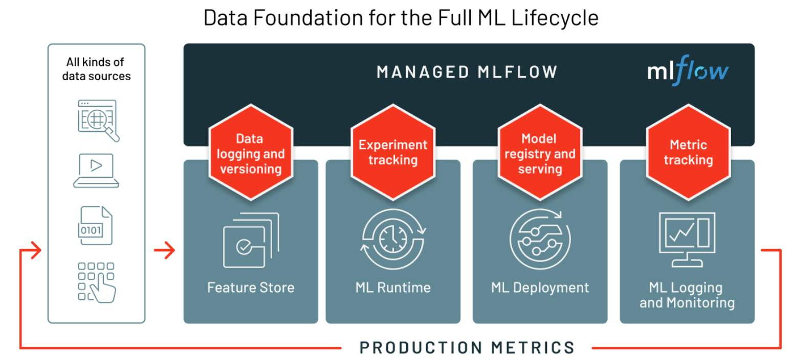
  

In addition to Managed MLflow, other Databricks ML components include Databricks Collaborative Notebooks, the Databricks Machine Learning Runtime, Feature Store, AutoML, and Model Serving.

| Component | Description |
| :---: | :----------- |
| Databricks Collaborative Notebooks | Collaborative notebooks are web-based interfaces that contain runnable code, visualizations, and narrative text. They are used in data science and machine learning to perform exploratory data analysis and build machine learning models. They support multiple programming languages (SQL, Scala, R, Python, and Java), built-in data visualizations, automatic versioning, and the ability to automate processes 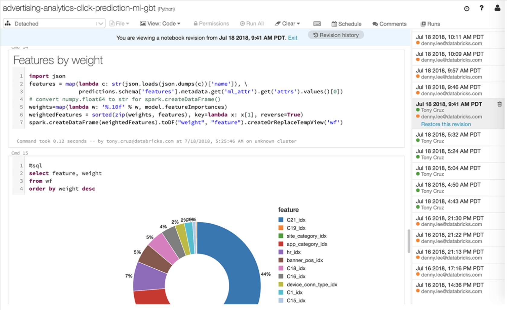|
| Databricks Machine Learning Runtime | The Machine Learning Runtime (MLR) provides data scientists and ML practitioners with scalable computing resources that come with built-in popular data science frameworks (interfaces that help data practitioners quickly build and deploy machine learning models). It provides an optimized computing environment for machine learning workflows 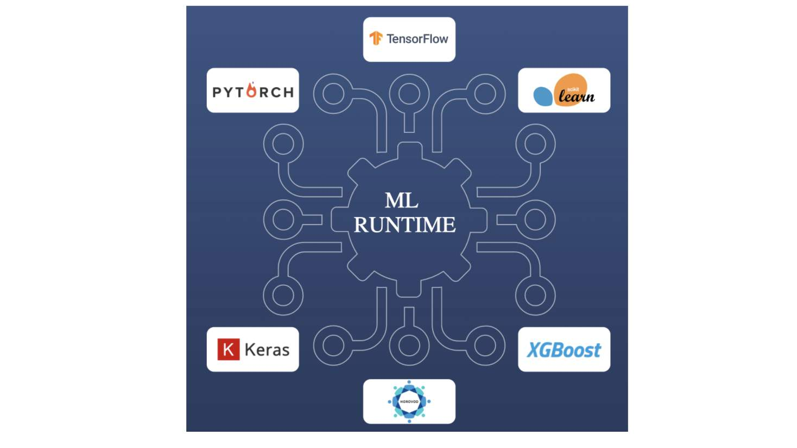|
| Feature Store | Feature Store provides data teams with the ability to streamline their work by creating new features to use in their machine learning models, exploring and reusing existing features, and building training data sets.|
| Auto ML | AutoML fast tracks the machine learning workflow by providing training code for trial runs of models - data scientists can use this code to quickly assess the feasibility of using a data set for machine learning or to get a quick sanity check on the direction of an ML project.|
| Managed MLflow | Managed MLflow is built on top of MLflow, an open-source platform developed by Databricks to help manage the complete machine learning lifecycle. With MLflow, you can track machine learning experiments, manage machine learning models, and deploy those models. |
| Model Serving | One-click deployment of any ML model as a REST endpoint for low latency serving. Integrates with the Model Registry to manage staging and production versions of endpoints.|

It’s important to stress that all of these capabilities are accessed in the Lakehouse platform. That means that as you and your colleagues use the different tools found within Databricks, you can also share all of the assets you create. 

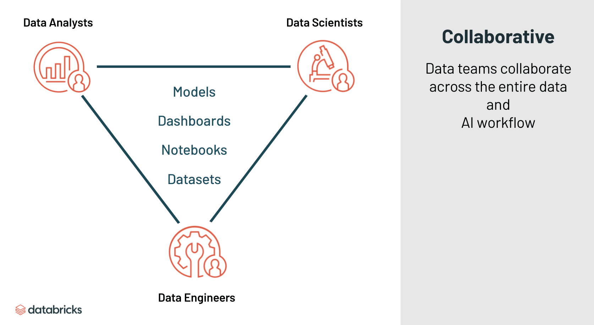

## Platform Security

### 1. Keeping data safe as an organization scales

A major difference between Databricks and other platform-as-a-service (PaaS) providers is that with Databricks, organizations always have control over their data - data at rest is stored in their cloud account. With data kept in their cloud accounts organizations have the ability to: 
- Use cloud-native identity providers that support SAML protocol to authenticate their users
- Use their existing identity providers to define access policies for all of the data in their data lake 
- Federate identity between their identity providers and Databricks to ensure secure access to data in object storage
- Retain full control over the keys used to encrypt their data (down to the individual notebook level)
- Set key hierarchy so that revoking a key severs access to data

In addition, data stored anywhere by Databricks clusters is always encrypted without having to worry about key and cert management. Plus, the Databricks Lakehouse Platform comes with native support for SCIM (System for Cross-domain Identity Management), meaning that organizations can automatically onboard and off-board users by syncing user management with their SSO identity provider.

### 2. Ensuring privacy for data practitioners 

Many times, it is necessary to provide transparency on projects - particularly projects where collaboration and real-time feedback are required. Other times, data practitioners working on projects need things locked down to ensure data/project privacy. With the Databricks Lakehouse Platform, you have the ability to do both. The platform comes with built-in features that enable organizations to create compliant and private analytic workspaces for their data practitioners, such as: 
- Customer-managed VPC/VNET - these are private networks that can be deployed with custom network configurations to comply with internal cloud and data governance policies (as well as adhere to external regulations).
- Access Control Lists / IP Whitelisting: This enables the use of strict IP access lists to specify which connections can or cannot be made in and out of an organization's workspaces, minimizing the attack surface. With access control lists / IP Whitelisting, all incoming access to an organization's Databricks Web application and REST APIs require users to connect from an authorized IP address or VPN.
- Code Isolation: This means that data practitioners can run their data analytics workflows on the same computational resources while ensuring that each user only has access to the data they are authorized to access. 
- Private Network between Data and Control Planes: The Databricks Lakehouse Platform is structured to enable secure cross-functional team collaboration while keeping a significant amount of backend services managed by Databricks. Databricks operates out of a control plane and a data plane. The control plane includes the backend services that Databricks manages in its own cloud account. The data plane is managed by an organization's cloud account and is where data resides and is processed. With private networks between data and control planes, all communications between control and data planes happen through private networks (they are not sent over public networks).

### 3. Meeting compliance and certification regulations

Databricks incorporates industry-leading best practices into its security program and employs independent, PCAOB-registered CPA firms to regularly audit the program and attest to its certifications. Additionally, a number of controls have been put in place to meet the unique compliance needs of highly regulated industries.

Databricks certifications and compliance attestations include:
- SOC 2 Type II
- ISO 27018
- ISO 27001
- HIPAA
- GDPR | Read our FAQ
- FedRAMP (Azure)
- PCI DSS (AWS)

