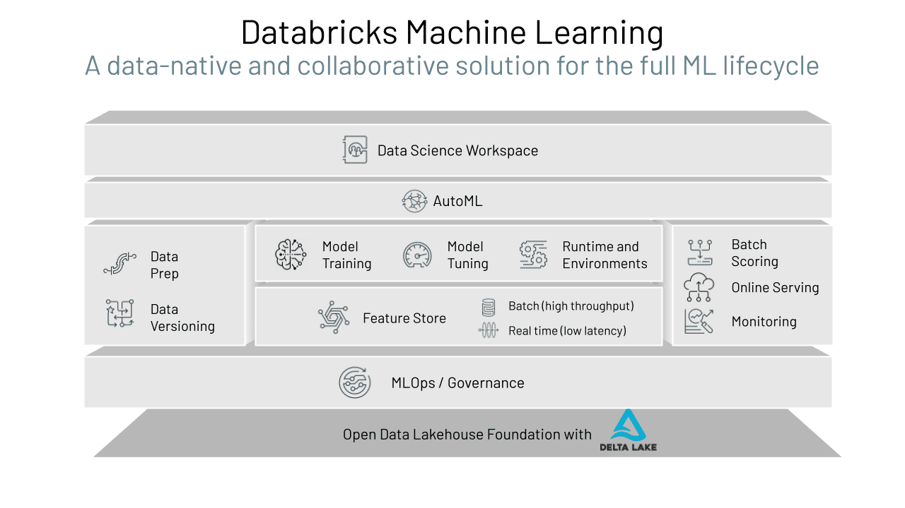
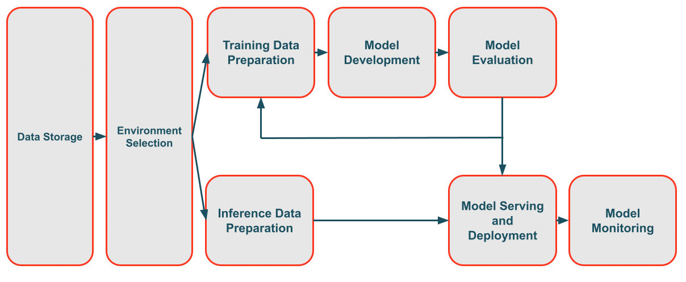
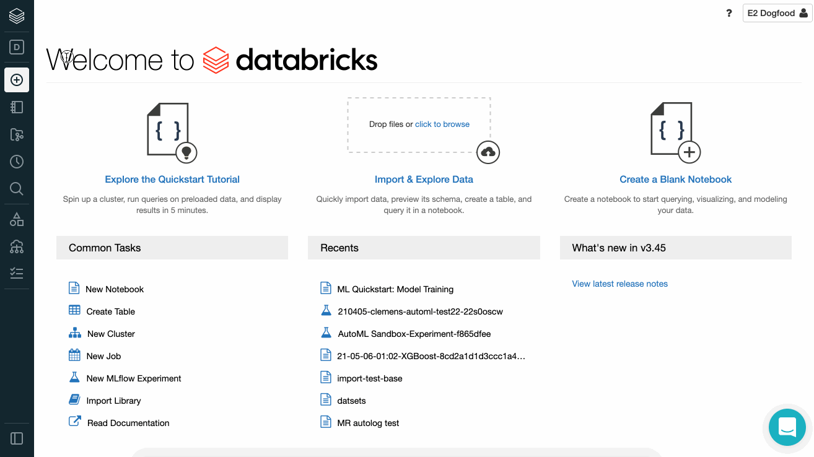
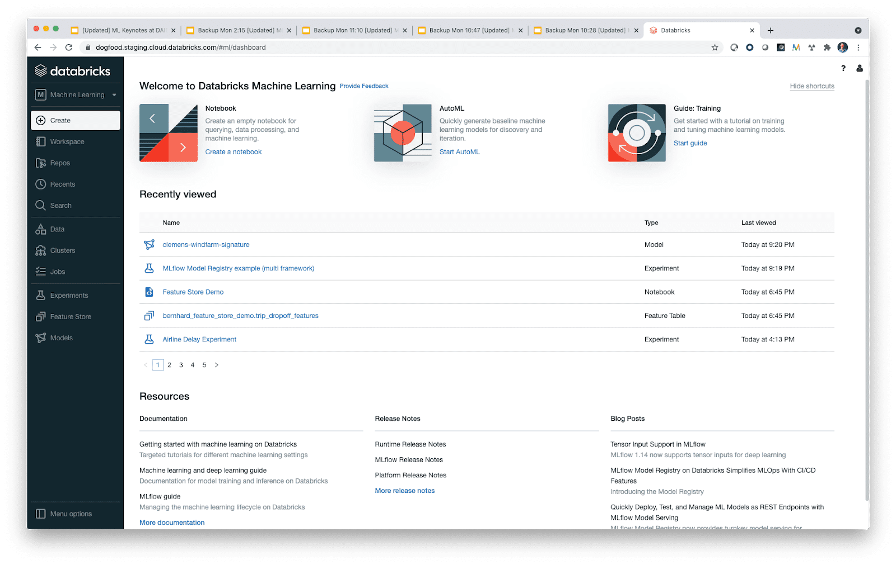
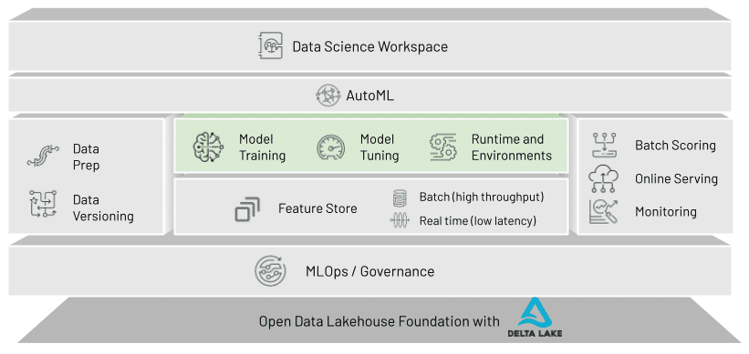
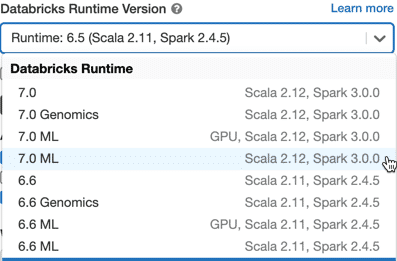
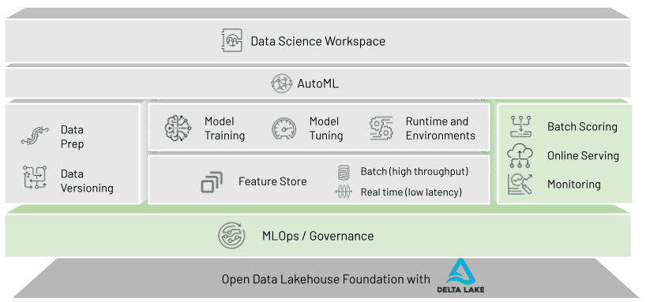
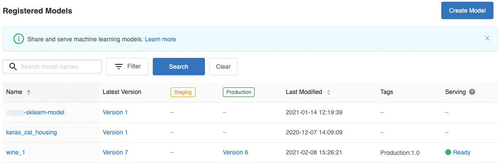
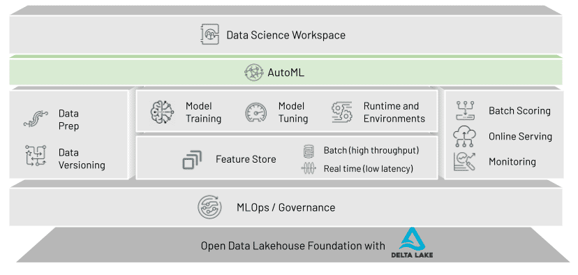
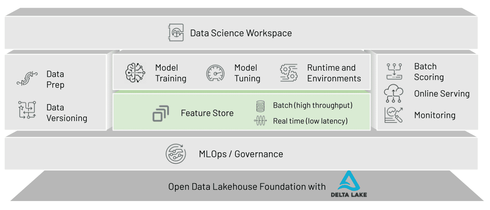

# Fundamentals of Databricks Machine Learning

## Databricks ML Overview

**1. The Lakehouse:**

 The Databricks Lakehouse platform provides data teams with the flexibility, cost-efficiency, and scale of data lakes with the data management and ACID transactions of data warehouses. This enables a variety of data practitioners – SQL analysts, data engineers, and machine learning practitioners – to perform their roles in a unified and scalable way.

This Lakehouse platform is powered by data tools like Apache Spark, Delta Lake, and MLflow. These high-quality, open-source software are even more powerful when used together to help data teams build scalable, reliable, production-ready data pipelines.

**2. Machine Learning in the Lakehouse**

Databricks Machine Learning is the data scientist and machine learning practitioner’s new access point for the Databricks Lakehouse platform. While there are a variety of places to complete machine learning work, there are a few major reasons for having machine learning practitioners working within the Lakehouse.

**Production machine learning depends on code and data:**
- The Databricks ML platform is data-native. This means that it sits in the exact same place as your data, so there’s no need to move your data from one place or another.
- Databricks ML supports easy integration for new and existing machine learning projects with Databricks Repos.

**Machine learning requires many different roles to get involved.**
- The Databricks ML platform sits within the larger Databricks platform. This includes environments friendly to data engineering and SQL analysis, so the whole team can get involved in the same platform using the same data.
- Databricks ML supports both machine learning development and production workflows, so data scientists and machine learning engineers can work together in the same place.

**Machine learning requires integrating many different components.**
- The Databricks ML platform includes tools to support the entire machine learning workflow. From feature organization to model serving and scoring, the tools in Databricks ML have you covered.
- All of these components come packaged in a tested platform and runtime, which makes architecting systems for individual projects easier.

**3. Databricks ML for the End-to-end ML Lifecycle**

Databricks ML is a data-native and collaborative solution for the full ML lifecycle. Whether a data practitioner is exploring or developing features to include in a machine learning model, scaling the training of many models, or deploying a model following a CI/CD process, Databricks ML is exactly where they need to be.

By including all of these features in a single platform, Databricks ML helps data teams solve the world’s toughest problems by simplifying each step of the machine learning workflow – this includes machine learning operations problems that have proved to be challenging to solve.

And accessing all of this functionality has never been easier. Using a user interface designed for the machine learning workflow, Databricks ML puts the Databricks platform’s machine learning-focused features front and center.

**4. Breakdown of Machine Learning Issues**

| Type | Issue | Solution |
| :---: | :----------- | :------------ |
| **Data quality** | Data quality issues are commonplace in machine learning applications. When data and machine learning work occur in different platforms, there’s always going to be an opportunity for data to become lost, corrupted, or miss out on vital cleaning tasks. | Because Databricks Machine Learning is data-native, it’s integrated with your data lakehouse following best-practice data architectures enabled by Delta Lake. In addition, because data engineers are operating on the same platform, they’re able to work together with machine learning teams to ensure data is of the highest quality. |
| **Compute resources** | Data practitioners frequently struggle with compute resources. They might be inefficiently allocating more cloud resources than needed, or they could be struggling to scale with limited on-premises servers. These problems can cost organizations in finances and time. | Databricks offers autoscaling for compute resources to ensure that practitioners are using the exact amount of resources they need. If you want more control, data scientists and machine learning engineers are able to select the size of their interactive and production compute clusters. Their organizations can limit their selections to a predetermined set. |
| **Feature development** | When solving data science problems, practitioners need to create their input datasets. The domain knowledge and engineering prowess necessary to do this requires time to develop and apply, so this can frequently be one of the most time-consuming parts of the machine learning lifecycle. In addition, this creates many opportunities for practitioners to accidentally miscalculate a feature value. | With Feature Store, a newer feature of Databricks Machine Learning, data teams are able to organize their computed features in a clean and centralized feature registry – this means that the days of recomputing features for scoring are over. |
| **Model development** | Once a feature set is created, data scientists and machine learning engineers need to develop models. However, the best model and best hyperparameters for that model can be costly to develop. Between the programming, testing, and iteration, this process can be difficult to get started and organize. | Databricks AutoML, a glass box automated machine learning solution, gets you started by building a series of models and logging the Run results to Experiments with MLflow. And better yet, AutoML gives you the code used to develop those models so you can make any changes and put them into production in the way you best see fit. |
| **Machine learning operations** | Developing machine learning models is just part of ML applications. Once they’re built, they need to be integrated into existing production settings and delivered to their end users. The combination of code, data, and other artifacts in this process has proven difficult to maintain. | MLflow Model Registry provides a centralized place to store and manage your machine learning models. With multiple built-in model stages, users are able to apply standard rules and deployment strategies to models in “Staging”, “Production”, and other stages using batch and streaming inference solutions and online serving tools like MLflow Model Serving. |
| **Governance and security** | Governing and securing data is not a new problem for data teams, but doing the same for artifacts like models and other parts of machine learning pipelines can be new territory. Unfortunately, many of the traditional tools for this type of governance don’t work in this ML-specific setting, and that makes it difficult to control who has access to your team’s machine learning applications. | Because Databricks ML is integrated with the rest of the Databricks platform, tools like the MLflow Model Registry are able to be restricted with access control lists (ACLs). This gives organizations the ability to control who is able to validate and deploy models in the same way they control access to standard tables in their Lakehouse, making governance and security for machine learning projects much simpler. |
| **Automation** | Many of these problems can be solved manually, but solving them in an automated way can be difficult. It frequently requires introducing new tools to the workflow, and that requires more software integration and another learning curve. | Databricks ML includes all of the excellent features of the standard Databricks platform, so users are able to use Jobs to automate their project workflow and lifecycle. Machine learning practitioners are able to schedule parts of their project to run on a specific frequency to take advantage of all of the benefits of Databricks ML on a regular, automated basis. |

## A. Components of Databricks Machine Learning

### 1. Databricks Machine Learning User Interface

Databricks Machine Learning is a collection of different tools and features, and users are able to access them all in a single place with persona-based navigation in the Databricks platform.

With existing tools like Data Science/Engineering and Databricks SQL, the new Machine Learning experience will be selectable in the platform sidebar. Of course, users are able to freely choose which experience is best for their given project.

If they do choose to use Databricks Machine Learning, the ML Dashboard will bring ML capabilities like Experiments, the Feature Store, and Model Registry all to the forefront.

### 2. Databricks Runtime for Machine Learning

The Databricks Runtime for Machine Learning (Databricks Runtime ML) automates the creation of an environment optimized for machine learning.

One of the major advantages of the Databricks Runtime ML is the inclusion of the most popular machine learning libraries like TensorFlow, PyTorch, Keras, XGBoost, and Scikit-learn. These libraries have been chosen by Databricks as the tools data scientists and machine learning engineers can use throughout the machine learning lifecycle. In addition to machine learning libraries, GPU-enabled ML runtimes are also available.

### 3. Databricks Jobs

**Automating Data Work**

A Databricks Job is a non-interactive way to run an application in a Databricks cluster. This provides an opportunity to automate machine learning pipelines – whether you want to run them immediately or on a scheduled basis.

Jobs can be created with specific environments, too, so that data teams are running their projects efficiently with all of the necessary libraries and dependencies.

### 4. Databricks Repos

Using Databricks Repos, users can sync their existing projects or new projects from within the Databricks ML platform. By integrating with Git repositories like Github, Bitbucket, and GitLab, data scientists and machine learning engineers can follow development best practices and better follow common integration, deployment, and delivery processes.

This feature allows users to use the same project structure within Databricks that they might use in other development environments, and an API is available in private preview for further automation.

## B. MLflow Overview

**MLflow** is one of the major components of performing machine learning on Databricks. It’s an open-source tool developed within Databricks for managing the entire machine learning lifecycle.

As a result, it brings a lot to the table in making effective machine learning simpler:

- Tracking: Allows you to track your model runs within experiments to record and compare results.
- Models: Allow you to manage and deploy models from a variety of ML libraries to a variety of model serving and inference platforms.
- Projects: Allow you to package ML code in a reusable, reproducible form to share with other data scientists or transfer to production.
- Model Registry: Allows you to centralize a model store for managing models’ full lifecycle stage transitions: from staging to production, with capabilities for versioning and annotating.
- Model Serving: Allows you to host MLflow Models for real-time serving.

### 1. MLflow Tracking

MLFlow Tracking enables data scientists and machine learning engineers to record information about their work. This includes things like what data they used to train a model, what parameters the model run used, and how well the model performed.

Information logged during tracking is stored in two concepts: **Runs** and **Experiments**.

**Experiments**: An MLflow Experiment is the primary unit of organization for MLflow Tracking. All MLflow runs belong to an experiment, and experiments let users organize and compare runs very easily. Within Databricks ML, Experiments can be easily browsed from the Experiments page – this is accessible on the left-side navigation bar.

**Run**: An MLflow run corresponds to a single execution of model code. It will record the following information:
  - The name of the notebook that launched the run.
  - The notebook version if it’s run from a notebook.
  - The start and end time of the run.
  - Any parameters and values of the parameters from the run.
  - Output metrics detailing the results of the run.
  - Tags to manually record useful information.
  - Artifacts like images, models, and data files.

For many libraries, MLflow will automatically track machine learning work so no additional programming is required. But there are also useful APIs for Python, R, and Java in case it’s needed for something more specialized.

### 2. MLflow Models

MLflow offers a standard format for machine learning models. By using MLflow Model flavors, models from libraries like PyTorch and Scikit-learn and standard Python functions can be logged as MLflow Models.

A major advantage of MLflow Models for data teams is that they can be interacted with and deployed downstream using the same code and workflow – this remains true no matter which flavor the model is! So machine learning teams no longer need to implement different deployment strategies for different types of models.

### 3.  MLflow Projects

An MLflow Project is a format for packaging data science code in a reusable and reproducible way to streamline machine learning operations.

The MLflow Projects component includes an API and command-line tools for running projects remotely on Databricks clusters. It also integrates with the Tracking component to automatically record the parameters and the source code for reproducibility.

### 4. MLflow Model Registry

MLflow Model Registry is a centralized model repository that enables you to manage the full lifecycle of MLflow Models. It has both a UI and a set of APIs that allows users to engage with interactively and in an automated fashion.

Model Registry provides chronological model lineage (which MLflow experiment and MLflow run produced the model at a given time), model versioning, stage transitions (for example, from staging to production or archived), and email notifications of model events. You can also create and view model descriptions and leave comments.

This feature becomes particularly powerful when combined using webhooks. Webhooks are a common mechanism to invoke some type of action. For example, a machine learning engineer can set up a webhook to automatically run a standard set of tests when a new model version is created and report back results. And again using webhooks, a team could set up notifications in a messaging service to alert the team when a user requests to move a model to production.

All of this allows organizations to have centralized, governed control over their model integration, delivery, and deployment processes.

### 5. MLflow Model Serving

MLflow Model Serving on Databricks allows users to deploy their machine learning models for real-time serving.

It hosts models from MLflow Model Registry as REST endpoints that are automatically updated as models transition into and out of the various Model Registry stages. In addition, Databricks automatically creates a unique serving cluster for the model and deploys all of the versions in the Model Registry as separate endpoints.

MLflow is an excellent resource for machine learning model management and operations, bringing an end-to-end lifecycle product directly into Databricks Machine Learning

## C. Basics of AutoML

Databricks AutoML helps practitioners automatically apply machine learning to a dataset. It utilizes popular open-source machine learning libraries to build the models.

Unlike other automated machine learning products, AutoML is a glass box solution. It utilizes popular open-source machine learning libraries to build the models. This means that data scientists and machine learning engineers can use and edit the AutoML-generated code into their machine learning pipelines. This prevents lock-in with automated machine learning vendors that keep everything within a black box.

AutoML is available both through the Databricks ML user interface and as a Python API.

When using the AutoML UI, users on Databricks ML will be able to manually create an AutoML experiment, select the appropriate cluster, set up a classification or regression problem, and select the label variables attempting to be predicted. This ML-friendly user interface is ideal for exploration stages early in machine learning application development because practitioners can quickly run a lot of models to get a decent idea of what type of model will best work. Then, they can utilize the generated code moving forward and add custom tasks like feature engineering.

When using the AutoML API, users on Databricks ML will be able to automate an AutoML experiment using the same information provided in the UI workflow.

Overall, using AutoML enables machine learning teams to work quickly without sacrificing flexibility, control, and the opportunity to add custom features to automated machine learning solutions.

## D. Feature Store

Feature Store is a centralized repository and registry for features, or input variables, to machine learning models.

This provides a number of benefits to machine learning teams. Organizations using Feature Store in Databricks ML can expect to have more reliable and efficient feature set calculations for training, and they will also be able to ensure that the same exact features are used when it’s time to compute predictions.

But a significant benefit of using Feature Store is to make features widely available across the organization. Feature Store provides a Feature Registry that keeps track of all features that have been created and facilitates reuse across different models. So if one data scientist develops a feature to use in a model, other data scientists will have access to that feature’s values and how that feature was created. This saves the organization time and money – Databricks has found that the Feature Registry alone saves multiple months of productivity in big data teams.

**Feature Store in a Data and MLOps Platform**

The Databricks Feature Store is the first that was co-designed with a data and machine learning operations platform. Because of this, it integrates very tightly with the rest of the features and products in Databricks Machine Learning.

**1. Feature Store and Delta Lake**

An initial major example of this integration is how Feature Store is built using Delta Lake. Because of this, Feature Store inherits all of Delta Lake’s benefits:

  - Open storage format
  - Build-in data versioning and governance
  - Native access through PySpark, SQL, etc.

This means that Feature Store can be used to train models from native modeling libraries and score models in batch using familiar APIs. The same features are also made available for low-latency online scoring – this solves the problem of data being computed in different ways.

**2. Feature Store and MLflow**

Another example of how tightly integrated Feature Store is with the rest of Databricks Machine Learning is through MLflow. Because we co-designed the feature store with MLflow, when a model gets trained using the Feature Store, we store the information about which features it consumes with the model itself.

As a result, in serving, the model can deal with the full complexity of looking up the right features from the feature store. This again simplifies the machine learning deployment process, allowing data teams to work more efficiently.